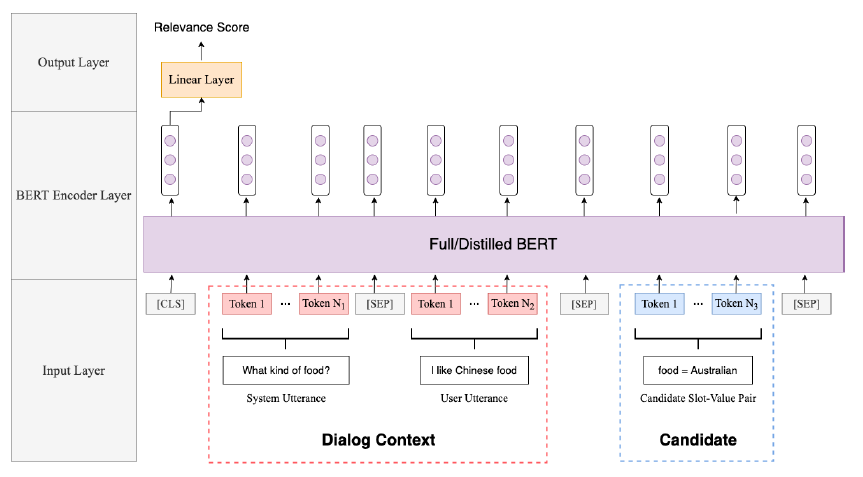

# Bert-DST
This method is adapted from 
[A Simple but Effective BERT Model for Dialog State Tracking on Resource-Limited Systems](https://arxiv.org/pdf/1910.12995.pdf). 
The paper was originally for a single-domain dataset WOZ2.0, and we made some minor changes here to apply to MultiWOZ



## Change Description
1. Add domain to candidate Slot-Value Pair, like **Restaurant - food = Australian**
2. There is a `ontology.json` in the [source project](https://github.com/laituan245/BERT-Dialog-State-Tracking), here 
are the slot and the corresponding values, Compared with the multi-domain MultiWOZ, it is much less, so the method of 
constructing the data set according to the source code is a disaster for MultiWOZ, which has about 15,000 lines. To preprocessing
data faster, We used a multi-process approach, but this step is still time-consuming, in the end we only used one-tenth of 
the training set, which is about 500 dialogues.
3. The original ontology of MultiWOZ has been cleaned up, see `script/dst/bert/utils.py` for the specific processing process 
4. For the action of Request type, because it has no value, using Request to replace Slot and Slot to replace Value

## Arguments Explanation
all training arguments are save in `xbot/config/dst/bert/train.json`
* random_undersampling: Whether to undersample negative samples，default: 1 (true)
* overall_undersampling_ratio: The ratio of undersampling training set, default: 0.1
* debug: Whether to use debug mode, In debug mode, you can quickly run a complete process, default: 0
* use_cache_data: Whether to use cached preprocessed data, default: 1

## Example Usage
To train a model from scratch, run following command:
```bash
$ cd xbot
$ python -m script.dst.bert.train
```

## Issues
At present, we feel that the way to calculate the joint goal in the source project is not reasonable. Here are some ideas:    

If the current label has only the request type, and the belief state contains the previous inform, and the pred inform 
must be empty, the pred recovered will definitely not be equal to the gold recovered. In another case, the turn label 
is empty, but the belief state is not empty, and if the model is good enough, the prediction is definitely empty, then 
the joint goal is definitely not equal. 

example (dev.json, dialogue_id:600, last turn):
```json
{
    "system_acts":[

    ],
    "system_transcript":"Chicquito's is located at 2G Cambridge Leisure Park Cherry Hinton Road Cherry Hinton, Phone 01223 400170, and the restaurant below that is called frankie and bennys. It has a phone number of 01223 412430 and address of Cambridge Leisure Park Clifton Way Cherry Hinton",
    "num":{
        "system_acts":[
            [
                0,
                16,
                1
            ]
        ],
        "transcript":[
            0,
            34,
            35,
            15,
            35,
            36,
            37,
            38,
            39,
            15,
            1
        ]
    },
    "belief_state":[
        {
            "slots":[
                [
                    "price range",
                    "expensive"
                ]
            ],
            "act":"inform"
        },
        {
            "slots":[
                [
                    "area",
                    "south"
                ]
            ],
            "act":"inform"
        }
    ],
    "turn_id":2,
    "transcript":[
        "Thank",
        "you",
        ".",
        "You",
        "have",
        "been",
        "most",
        "helpful",
        "."
    ],
    "turn_label":[

    ]
}
```

Welcome everyone to open issue！